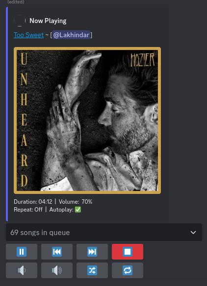

# Distube Music Bot

It is a Discord music bot built using [distube](https://npm.im/distube) & [discord.js](https://npm.im/discord.js) library.

## Table of Contents

- [Disclaimer](#disclaimer)
- [Features](#features)
- [Docs](docs/README.md):
  - [Commands](docs/COMMANDS.md)
  - [Installation](docs/INSTALLATION.md)
    - [Prerequisites](docs/INSTALLATION.md#prerequisites)
    - [Configuration](docs/INSTALLATION.md#configuration)
    - [Local Installation](docs/INSTALLATION.md#local-installation)
    - [Docker Installation](docs/INSTALLATION.md#docker-installation)
  - [Contributing](docs/CONTRIBUTING.md)
- [License](#license)
- [Help](#help)
- [Feedback](#feedback)
- [Star History](#star-history)
- [Supporters](#supporters)

## Disclaimer

This project is not affiliated with Discord or any streaming platforms. It is intended for educational and entertainment purposes only. It is not designed to encourage or facilitate any form of unfair usage. If you represent a supported streaming platform and have concerns about the bot's functionality, please reach out to us via GitHub Discussions or our support channels for a constructive dialogue.

## Features

- **Beginner-Friendly**: Easy to use for all skill levels.
- **Quick Setup**: Simple docker installation with minimal configuration.
- **Various Sources**: Stream music from YouTube, Spotify, SoundCloud, Apple Music, Deezer, Tidal, and more.
- **Audio Filters**: Inbuilt audio filters.
- **Button Control**: Intuitive buttons for easy music control.
- **Slash Commands**: Seamless interaction through intuitive slash commands.
- **Versatile Commands**: Extensive range of music playback commands.
- **Multi-Guild Support**: Manage the bot across multiple Discord servers.

## Previews

## Docs

[View docs](docs/README.md)

## License

This project is licensed under the terms of the GNU General Public License v3.0. See the [LICENSE](LICENSE) file for details.

## Help

If you need further help with this project, to get support faster you can join the Discord server by just clicking [here](https://discord.gg/8yaJBZBQTA).

## Feedback

We value your feedback! If you have any suggestions, feature requests, or bug reports, please open an issue or reach out to us on Discord.

## Star History

## Supporters

---

